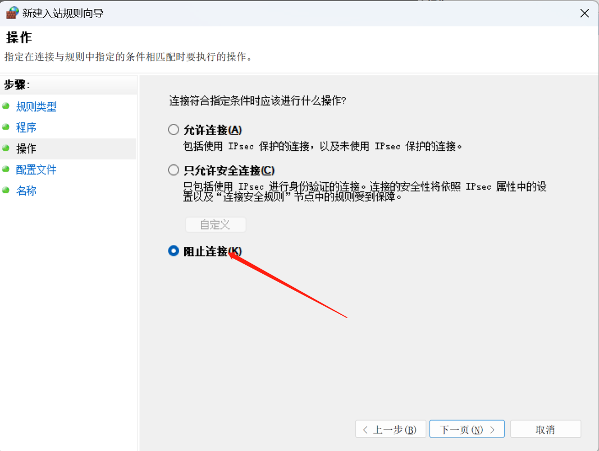

> [!NOTE]
>
> ==友情提示：Keil5并非唯一的编译工具，其他工具如vs code，IDEA等也可完成编译工作。==
>
> ==由于keil5是一款付费软件，使用盗版软件要注意律师函警告。==
>
> ==不过可以通过其他方式只使用keil API接口而不用软件本身的方式来规避此风险。==

> - # 软件获取

> [!IMPORTANT]
>
> 获取keil5软件方法：微信公众号搜索软件管家，进入软件目录，选择windows版本。
>
> 
>
> 找到开发编程版块，选择keil软件，选择需要的版本，并按照教程完成软件安装。
>
> 

> - #  开始前的准备

> [!WARNING]
>
> ==开始前的准备：==
>
> ==方法1： 简单粗暴法，在运行软件前关闭网络，有用但很不方便==
>
> 
>
> ==方法2： 开启防火墙。==
>
> ==键盘同时按下win+r按键，在弹出界面输入cmd后点击确定。==
>
> 
>
> ==在弹出界面输入Firewall.cpl，然后回车，开启防火墙界面，点击高级设置。==
>
> 
>
> 
>
> ==选择入站规则后新建规则==
>
> 
>
> 
>
> ==按照以下步骤完成配置==
>
> 
>
> 
>
> 
>
> 
>
> 
>
> 
>
> 
> 
>==配置完成后点击出站规则，按照相同步骤完成配置即可。==

> - # 其他防止律师函的解决方法

> [!TIP]
>
> Visual Studio Code（简称VSCode）是由微软开发的一款轻量级的跨平台代码编辑器。具有强大的代码编辑和调试功能，同时支持版本控制、智能代码补全、代码片段、内置终端等特性。它支持多种编程语言，并且提供了丰富的扩展插件生态系统，使得开发者可以根据自己的需求自定义和扩展编辑器的功能。
>
> 此处要介绍的便是基于keil.exe程序的自动编译插件，此插件无需使用破解版keil软件，绿色安全，完全不用担心会被律师函。
>
> **<u>[vs code 下载地址](https://code.visualstudio.com/download)</u>**
>
> ==使用方法：在vs code 界面搜索Keil Assistant插件并安装启用，进入设置界面，添加keil5安装路径==
>
> 
>
> 
>
> ==配置完成后在vs code中打开一个项目，在KEIL UVISION PROJECT栏目新建项目，找到路径下的工程文件。==
>
> 
>
> 
>
> ==完成后便可进行代码开发，编译和下载。==
>
> 
>
> ==更改键盘快捷键：打开键盘快捷设置界面，搜索keil关键词后即可配置快捷键。==
>
> 